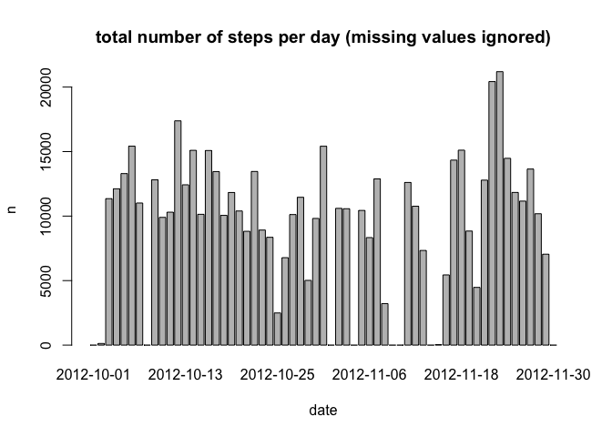
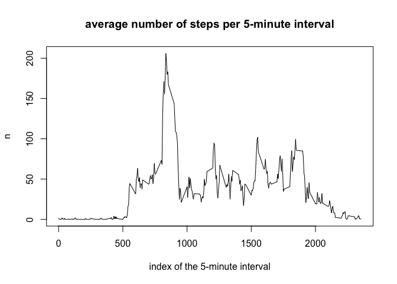
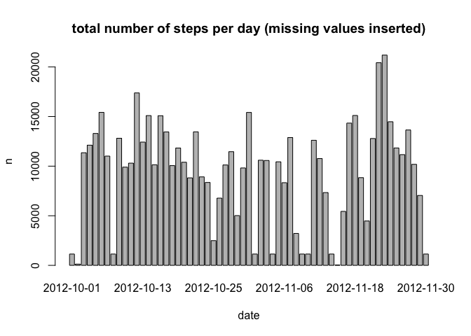
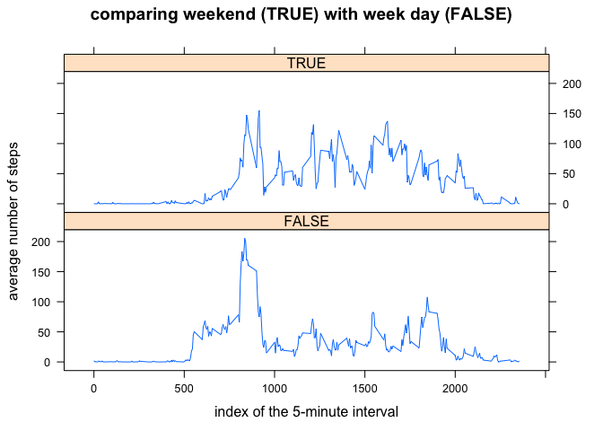

# Reproducible Research: Peer Assessment 1


## Loading and preprocessing the data

First load the dplyr libraries which we will use for the analysis

```r
library(dplyr)
```

```
## 
## Attaching package: 'dplyr'
## 
## The following objects are masked from 'package:stats':
## 
##     filter, lag
## 
## The following objects are masked from 'package:base':
## 
##     intersect, setdiff, setequal, union
```

Read the data from the CSV file, which is inside the zip file

```r
rawData <- read.csv(unz("activity.zip","activity.csv"),
                    sep = ",",
                    na.strings = c("NA"),
                    stringsAsFactors = FALSE
                    )
```

## What is mean total number of steps taken per day?
To calculate the mean number of steps per day, we have to group the data by day first,
and then we summarise the data by taking the sum of the steps by day. 

Until further notice, we ignore missing values. (Hence, we may underestimate the number of steps for certain days.)

We show the first ten values of the resulting data

```r
stepsPerDay <- rawData %>% group_by(date)
totalNumberOfStepsPerDay <- stepsPerDay %>% 
  summarise(totalStepsPerDay=sum(steps,na.rm=TRUE))
totalNumberOfStepsPerDay
```

```
## Source: local data frame [61 x 2]
## 
##          date totalStepsPerDay
##         (chr)            (int)
## 1  2012-10-01                0
## 2  2012-10-02              126
## 3  2012-10-03            11352
## 4  2012-10-04            12116
## 5  2012-10-05            13294
## 6  2012-10-06            15420
## 7  2012-10-07            11015
## 8  2012-10-08                0
## 9  2012-10-09            12811
## 10 2012-10-10             9900
## ..        ...              ...
```

Now plot the total number of steps per day as a function of the date

```r
barplot(height=totalNumberOfStepsPerDay$totalStepsPerDay,
        names.arg=totalNumberOfStepsPerDay$date,
        main="total number of steps per day (missing values ignored)",
        xlab="date", ylab="n")
```

 

The mean and the median total steps per day can be deduced, together with the
sum of all steps taken over the measured period. The values are printed.

```r
meanAndMedianTotalStepsPerDay <- totalNumberOfStepsPerDay %>%
  summarise(mean=mean(totalStepsPerDay),
            median=median(totalStepsPerDay),
            sum=sum(totalStepsPerDay))
meanAndMedianTotalStepsPerDay
```

```
## Source: local data frame [1 x 3]
## 
##      mean median    sum
##     (dbl)  (int)  (int)
## 1 9354.23  10395 570608
```

## What is the average daily activity pattern?


```r
stepsPerInterval <- rawData %>% group_by(interval)
averageNumberOfStepsPerInterval <- stepsPerInterval %>%
  summarise(meanStepsPerInterval=mean(steps,na.rm=TRUE))
plot(averageNumberOfStepsPerInterval$interval,
     averageNumberOfStepsPerInterval$meanStepsPerInterval,
     type = "l",
     main = "average number of steps per 5-minute interval",
     xlab = "index of the 5-minute interval",
     ylab = "n")
```

 
The 5-minute interval of the day with the maximum number of average steps 
per day is shown below.

```r
intervalWithMaxAverageNumberOfSteps <- averageNumberOfStepsPerInterval %>%
  filter(meanStepsPerInterval==max(meanStepsPerInterval,na.rm=TRUE))
intervalWithMaxAverageNumberOfSteps
```

```
## Source: local data frame [1 x 2]
## 
##   interval meanStepsPerInterval
##      (int)                (dbl)
## 1      835             206.1698
```


## Imputing missing values

So far, we have ignored any missing values in the data. Obvisouly, this will
underestimate the total number of steps taken on days with missing data

We will estimate the actual values of the missing data by inserting the mean
value for that specific interval. Other insertion strategies may be chosen, which may result in different outcomes. 

Here we will examine the effect of our insertion strategy on the mean and median 
total number of steps taken.


```r
numberOfMissingValues <- rawData %>% filter(is.na(steps)) %>% count()
medianNumberOfStepsPerInterval <- stepsPerInterval %>%
  summarise(medianStepsPerInterval=median(steps,na.rm=TRUE))
medianSteps <- medianNumberOfStepsPerInterval$medianStepsPerInterval
cleanedData <- cbind(rawData,medianSteps)
estimatedSteps <- ifelse(is.na(cleanedData$steps),
                         cleanedData$medianSteps,
                         cleanedData$steps)
cleanedData <- cbind(rawData,estimatedSteps)
```
We will now redo our initial analysis on the data with the inserted values.

```r
stepsPerDay2 <- cleanedData %>% group_by(date)
totalNumberOfStepsPerDay2 <- stepsPerDay2 %>% 
  summarise(totalStepsPerDay=sum(estimatedSteps))
barplot(height=totalNumberOfStepsPerDay2$totalStepsPerDay,
        names.arg=totalNumberOfStepsPerDay2$date,
        main="total number of steps per day (missing values inserted)",
        xlab="date", ylab="n")
```

 

```r
meanAndMedianTotalStepsPerDay2 <- totalNumberOfStepsPerDay2 %>%
  summarise(mean=mean(totalStepsPerDay),
            median=median(totalStepsPerDay),
            sum=sum(totalStepsPerDay))
meanAndMedianTotalStepsPerDay2
```

```
## Source: local data frame [1 x 3]
## 
##       mean median    sum
##      (dbl)  (int)  (int)
## 1 9503.869  10395 579736
```
Now compare the data with and without missing values. This shows the effect of the 
insertion of mean values for the missing values.

```r
meanAndMedianTotalStepsPerDay
```

```
## Source: local data frame [1 x 3]
## 
##      mean median    sum
##     (dbl)  (int)  (int)
## 1 9354.23  10395 570608
```

```r
meanAndMedianTotalStepsPerDay2
```

```
## Source: local data frame [1 x 3]
## 
##       mean median    sum
##      (dbl)  (int)  (int)
## 1 9503.869  10395 579736
```
The total number of steps inserted was:

```r
meanAndMedianTotalStepsPerDay2$sum[1]-meanAndMedianTotalStepsPerDay$sum[1]
```

```
## [1] 9128
```
The undersetmiation of the mean was (in percetage):

```r
(meanAndMedianTotalStepsPerDay2$mean[1]-meanAndMedianTotalStepsPerDay$mean[1])*100/
  meanAndMedianTotalStepsPerDay$mean[1]
```

```
## [1] 1.599697
```
The undersetmiation of the median was (in percetage):

```r
(meanAndMedianTotalStepsPerDay2$median[1]-meanAndMedianTotalStepsPerDay$median[1])*100/
  meanAndMedianTotalStepsPerDay$median[1]
```

```
## [1] 0
```

## Are there differences in activity patterns between weekdays and weekends?

Here we perform the analysis on the data with the inserted values for the missing data.

First we add a column denoting whether the date is a weekend day or not. 
To avoid locale issues with the weekdays() function, we define the weekend from known 
weekend dates, Saturday 9th January 2016 and Sunday 10th January.
We then create two data frames, one for the week days, and one for the weekend days.
Then we summarise the data and take the mean number of steps per interval.


```r
weekend <- weekdays(as.Date(c("2016-01-09","2016-01-10")))
isWeekend <- weekdays(as.Date(cleanedData$date)) %in% weekend
weekendData <- cbind(cleanedData,isWeekend) %>% group_by(isWeekend,interval)

averageNumberOfStepsPerInterval <- weekendData %>% 
  summarise(meanStepsPerInterval=mean(estimatedSteps))
```

Next we create a plot of the two time series.


```r
library(lattice)
xyplot(meanStepsPerInterval ~ interval | isWeekend, 
       data = averageNumberOfStepsPerInterval, 
       layout = c(1, 2),
       type = "o",
       pch = " ",
       main = "comparing weekend (TRUE) with week day (FALSE)",
       xlab = "index of the 5-minute interval",
       ylab = "average number of steps")
```

 

From the plot we conclude that on weekends stepping starts later on the day, 
and is more spread across the day, than on week days.

This concludes the analysis.

